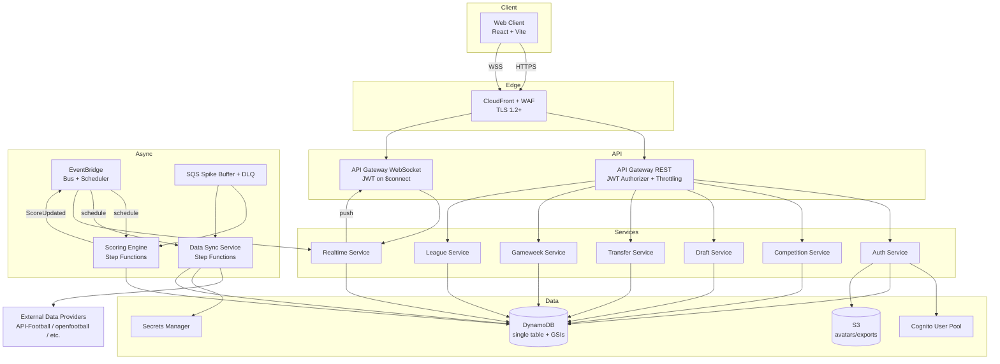
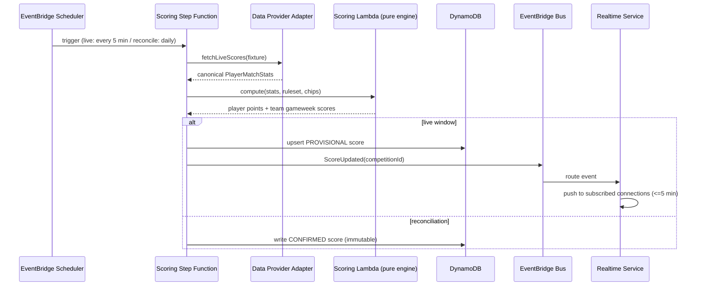
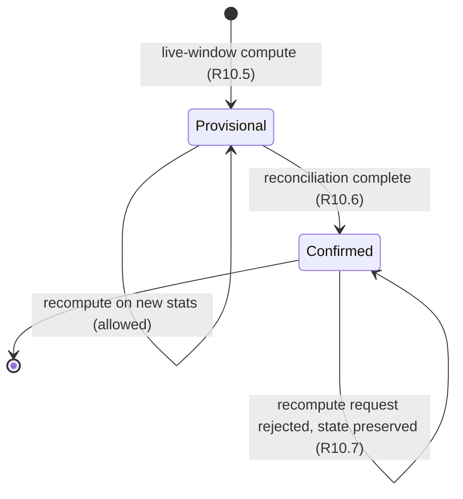

# Design Document

## Overview

The Multi-Sport Fantasy League Engine is a multi-tenant, multi-sport fantasy platform that launches with FIFA World Cup 2026 and is architected so that onboarding a new competition (Bundesliga, Premier League, NBA, Euroleague, etc.) is a **configuration change, not a code rewrite**. The central design principle is that _a competition is data_: positions, squad size, budget, transfer rules, chips, schedule, scoring rules, and the data provider are all stored in a `Competition` configuration record. Both the backend services and the React frontend render dynamically from this configuration, so adding a competition requires zero frontend code changes.

The system is built on AWS serverless infrastructure (Lambda, API Gateway REST + WebSocket, DynamoDB single-table design, EventBridge, Step Functions, SQS, S3, CloudFront, Cognito, Secrets Manager, WAF), provisioned entirely through AWS CDK in TypeScript. The frontend is a React + Vite + TypeScript application using Tailwind CSS, TanStack Query (server state), Zustand (client state), and React Router.

### Design Goals

1. **Portability** — A new competition is a `Competition` record + `ScoringRuleset` + `DataProviderAdapter` binding. No code changes to scoring, frontend, or services.
2. **Correctness** — Scoring is deterministic and idempotent; confirmed scores are immutable; data sync is idempotent and never leaves partial state.
3. **Resilience at game-day scale** — 10k concurrent users per competition, with SQS buffering of scoring/sync spikes and read latency held at p95 ≤ 200 ms.
4. **Security by default** — JWT validation on every request, TLS 1.2+, WAF, rate limiting, encryption at rest, CORS allow-listing, and rotated provider secrets.

### Requirements Coverage Map

| Area                             | Requirements     | Primary Components                                           |
| -------------------------------- | ---------------- | ------------------------------------------------------------ |
| Auth & sessions                  | R1, R18.2–R18.3  | Cognito, Auth Lambda, API Gateway JWT authorizer             |
| Profiles & preferences           | R2               | Auth Service, S3 (avatars)                                   |
| Competition discovery & theming  | R3, R4, R16.3    | Competition Service, Web Client theming layer                |
| Drafting & budget/position/cap   | R5, R6           | Draft Service                                                |
| Transfers, penalties, carry-over | R7               | Transfer Service                                             |
| Chips                            | R8               | Gameweek Service, Scoring Engine                             |
| Deadline enforcement             | R8a              | Gameweek Service (server UTC clock)                          |
| Auto-substitution                | R9               | Gameweek Service (finalization step)                         |
| Scoring engine                   | R10              | Scoring Engine (Step Functions + Lambda)                     |
| Live updates                     | R11              | Realtime Service (WebSocket)                                 |
| Leagues & standings              | R12, R13         | League Service                                               |
| League chat                      | R14              | League Service + Realtime Service                            |
| Data sync                        | R15, R16.4–R16.6 | Data Sync Service, Data Provider Adapter                     |
| Portability                      | R16              | Competition Service, Adapter registry                        |
| API envelope & validation        | R17              | API middleware (shared Lambda layer)                         |
| Security controls                | R18              | CloudFront/WAF, API Gateway, Cognito, Secrets Manager        |
| Performance & availability       | R19              | CloudFront, SQS, DynamoDB on-demand, provisioned concurrency |

## Architecture

### System Context



### Request Flow Patterns

**Synchronous read/write (REST):** Web Client → CloudFront (WAF, TLS) → API Gateway (JWT authorizer + per-user throttling) → routing Lambda → service layer → DynamoDB. Every response is wrapped in the standard envelope (R17) by a shared middleware layer.

**Live updates (WebSocket):** Web Client establishes a WSS connection; the `$connect` route runs a Lambda authorizer that validates the Cognito JWT (R11.2, R11.3). Connection IDs and their competition subscriptions are stored in DynamoDB. When the Scoring Engine emits a `ScoreUpdated` event, EventBridge routes it to the Realtime fan-out Lambda, which queries subscriptions by competition (GSI) and pushes only to subscribed connections (R11.1).

**Asynchronous scoring/sync:** EventBridge Scheduler triggers Step Functions state machines on cron schedules. During spikes (R19.3), scoring/sync work is enqueued to SQS and consumed by Lambda at a controlled concurrency so write paths stay within latency budgets.

### Scoring Pipeline Orchestration



The Scoring Engine is split into two layers: a **pure, deterministic computation Lambda** (no I/O, the unit under property-based test) and an **orchestration layer** (Step Functions + I/O Lambdas) that fetches stats, persists results, and emits events. This separation is what makes scoring determinism (R10.9) and confirmed-score immutability (R10.7) testable in isolation.

### Provisional → Confirmed Score Lifecycle



A gameweek score item carries a `scoreStatus` attribute (`PROVISIONAL` | `CONFIRMED`). Recomputation requests use a DynamoDB conditional write (`attribute_not_exists` of confirmation or `scoreStatus <> CONFIRMED`); a confirmed score rejects the write and the engine returns a "finalized" indication (R10.7).

## Components and Interfaces

All services share a common Lambda layer providing: the API response envelope, request-id propagation, Zod-based request validation, structured logging with correlation IDs, JWT context extraction, and a DynamoDB repository client.

### Shared API Middleware (R17, R18.9)

```typescript
interface ApiSuccess<T> {
  success: true;
  data: T;
  meta: { requestId: string; timestamp: string }; // timestamp in UTC ISO-8601
}

interface ApiError {
  success: false;
  error: { code: string; message: string; details?: Record<string, unknown> };
  meta: { requestId: string; timestamp: string };
}

type ApiResponse<T> = ApiSuccess<T> | ApiError;

// requestId resolution (R17.3): reuse client-supplied `x-request-id` header if present,
// otherwise generate a UUID v4. The same id is threaded through logs for tracing.
function resolveRequestId(headers: Record<string, string>): string;

// Validation runs BEFORE any state change (R17.4). On failure -> VALIDATION_ERROR with
// field-level detail (R17.5). On unparseable body -> MALFORMED_REQUEST_BODY (R17.6).
function withValidation<I>(schema: ZodSchema<I>, handler: Handler<I>): Handler;
```

### Auth Service (R1, R2)

Backed by a Cognito User Pool (email + optional social IdP). Password policy, lockout (5 failures / 15 min → 15 min lock, R1.10), token lifetimes (access 60 min, refresh 30 days), and email verification are enforced by Cognito configuration; the service wraps Cognito and maps results to the platform envelope and error codes.

```typescript
interface AuthService {
  register(email: string, password: string): Promise<void>; // R1.1, R1.2, R1.8
  signIn(email: string, password: string): Promise<TokenPair>; // R1.3, R1.4, R1.9, R1.10
  refresh(refreshToken: string): Promise<{ accessToken: string }>; // R1.5
}

interface ProfileService {
  getProfile(userId: string): Promise<UserProfile>; // R2.1
  updateDisplayName(userId: string, name: string): Promise<UserProfile>; // R2.2, R2.3 (1..50)
  updateNotificationPrefs(
    userId: string,
    prefs: NotificationPrefs,
  ): Promise<UserProfile>; // R2.4, R2.5
  createAvatarUploadUrl(
    userId: string,
    contentType: string,
  ): Promise<{ url: string }>; // R2.6, R2.7
}
```

Avatar uploads use an S3 pre-signed URL constrained to JPEG/PNG and ≤ 5 MB; format/size violations are rejected before the avatar reference is updated (R2.7).

### Competition Service (R3, R16)

```typescript
interface CompetitionService {
  list(filter?: { status?: "completed" }): Promise<Competition[]>; // R3.1, R3.3, R3.4 (<=100)
  getById(competitionId: string): Promise<Competition>; // R3.2, R3.5 (COMPETITION_NOT_FOUND)
  create(config: CompetitionInput): Promise<Competition>; // R16.1 (status=draft), R16.2
}
```

`create` validates referential integrity: the referenced `ScoringRuleset`, `DataProviderAdapter`, and `RosterConfig` must exist; missing/invalid fields are reported per-field and nothing is persisted (R16.2). New competitions are persisted with status `draft` and become available for activation within 5 s (R16.1).

### Draft Service (R5, R6)

```typescript
interface DraftService {
  getPlayerPool(
    competitionId: string,
    filters: PlayerFilters,
  ): Promise<Player[]>; // R5.1, R5.2
  submitSquad(
    userId: string,
    input: SquadInput,
  ): Promise<{ remainingBudget: number }>; // R5.3–R5.8
  autoPick(userId: string, fantasyTeamId: string): Promise<FantasyTeam>; // R5.9, R5.10
  setCaptaincy(userId: string, c: CaptaincyInput): Promise<void>; // R5.11, R5.12
  setFormation(userId: string, f: FormationInput): Promise<void>; // R6.1–R6.5
}
```

Squad validation is a pure function over the competition `RosterConfig`: it checks squad size, per-position min/max, per-real-world-team cap, distinct players, competition membership, and budget. Each failure maps to a specific error code; on any failure the previously persisted team is left unchanged. Formation validation is similarly pure (starting count = `startingXI`, per-position min/max, members-of-squad), and rejects submissions once the lineup deadline lock is active (R6.5).

### Transfer Service (R7)

```typescript
interface TransferService {
  submitTransfer(userId: string, t: TransferInput): Promise<TransferResult>; // R7.1–R7.6, R7.8
  grantGameweekTransfers(
    competitionId: string,
    gameweek: number,
  ): Promise<void>; // R7.7
}
```

Free-transfer accounting: each new gameweek grants the configured free transfers plus unused carry-over, capped at the configured carry-over limit (default 2) (R7.7). Transfers beyond the free allowance deduct the configured penalty (default 4 points) from the gameweek score (R7.3), unless a Wildcard or Free Hit is active (R7.8). Deadline, budget, and duplicate checks reject with `TRANSFER_DEADLINE_PASSED`, `BUDGET_EXCEEDED`, `PLAYER_ALREADY_IN_SQUAD` respectively.

### Gameweek Service (R8, R8a, R9)

```typescript
interface GameweekService {
  activateChip(userId: string, chip: ChipType, gameweek: number): Promise<void>; // R8.1, R8.6–R8.9
  getGameweekState(
    competitionId: string,
    gameweek: number,
  ): Promise<GameweekState>; // R8a.3
  finalizeGameweek(competitionId: string, gameweek: number): Promise<void>; // R9.1–R9.5
}
```

**Deadline enforcement (R8a):** a single guard, `assertBeforeDeadline(competitionId, gameweek)`, uses the **server-side UTC clock as the sole authoritative time source** (R8a.4) and is applied to every squad/transfer/captain/chip mutation. At or after the deadline, mutations are rejected and state is unchanged (R8a.1); before it, they are accepted (R8a.2).

**Auto-substitution (R9):** runs during finalization. Inactive starters (0 minutes) are evaluated in ascending starting-lineup order; each is replaced by the highest-priority bench player with ≥ 1 minute that preserves `RosterConfig` position constraints, completing one substitution before the next (R9.3). Captain → vice-captain multiplier transfer applies when the captain played 0 minutes and the vice played ≥ 1 (R9.4); if both played 0, no multiplier is applied (R9.5).

### Scoring Engine (R10)

```typescript
// Pure, deterministic, I/O-free — the unit under property-based test.
interface ScoringEngine {
  computePlayerPoints(
    stats: PlayerMatchStats,
    ruleset: ScoringRuleset,
    position: string,
  ): ScoredPlayer;
  computeTeamGameweekScore(
    team: FantasyTeam,
    scored: Map<string, ScoredPlayer>,
    chips: ActiveChips,
  ): TeamGameweekScore;
}

interface ScoredPlayer {
  playerId: string;
  total: number; // may be negative (R10.1)
  breakdown: StatPoints[]; // signed per-stat values (R10.8)
}
interface StatPoints {
  stat: string;
  points: number;
} // positive=awarded, negative=deduction
```

The engine applies the competition `ScoringRuleset` including per-every-N rules (e.g., 1 pt per 3 saves), minutes-played thresholds, and negative deductions, allowing negative net totals (R10.1). Team score = sum of starters with captain multiplied by the configured multiplier (default 2) (R10.2); Triple Captain → ×3 (R10.3, R8.3); Bench Boost → include bench players (R10.4, R8.4). The orchestration layer marks results `PROVISIONAL` in the live window (R10.5) and `CONFIRMED` after reconciliation (R10.6); confirmed scores reject recomputation (R10.7).

### Realtime Service (R11, R14)

```typescript
interface RealtimeService {
  onConnect(connectionId: string, jwt: string): Promise<void>; // R11.2, R11.3
  subscribe(connectionId: string, competitionId: string): Promise<void>; // R11.6 (<=50)
  onReconnect(connectionId: string, jwt: string): Promise<void>; // R11.5 (restore subs)
  fanOut(event: ScoreUpdated | ChatMessage): Promise<void>; // R11.1, R14.1
}
```

Connections and subscriptions are stored in DynamoDB keyed for competition fan-out via a GSI. `$connect` rejects missing/expired/invalid-signature JWTs (R11.3). A per-connection subscription cap of 50 is enforced (R11.6). Reconnect restores prior subscriptions within 2 s (R11.5). Score updates reach subscribed clients within the 5-minute freshness target (R11.4, R19.5).

### League Service (R12, R13, R14)

```typescript
interface LeagueService {
  createLeague(userId: string, input: LeagueInput): Promise<League>; // R12.1 (8-char unique join code)
  joinByCode(userId: string, joinCode: string): Promise<void>; // R12.2, R12.4–R12.7
  joinPublic(userId: string, leagueId: string): Promise<void>; // R12.3–R12.7
  getStandings(leagueId: string): Promise<StandingsEntry[]>; // R13.1–R13.7
  generateH2HSchedule(leagueId: string): Promise<Fixture[]>; // R13.5 (round-robin)
  postMessage(
    userId: string,
    leagueId: string,
    body: string,
  ): Promise<ChatMessage>; // R14.1–R14.4
  getChatHistory(
    leagueId: string,
    pageToken?: string,
  ): Promise<Page<ChatMessage>>; // R14.5 (<=50)
}
```

Standings support classic (descending cumulative total, tie-break by most recent gameweek score, shared ranks) and head-to-head (3/1/0, tie-break by cumulative total points) (R13.1–R13.4). H2H schedule is a single round-robin where each member meets every other exactly once before any repeat (R13.5). Chat enforces 1–500 chars after trimming, membership, and delivery in chronological order via the Realtime Service (R14).

### Data Sync Service & Data Provider Adapter (R15, R16.4–R16.6)

```typescript
interface DataProviderAdapter {
  fetchRosters(competitionId: string): Promise<Player[]>;
  fetchFixtures(competitionId: string): Promise<Fixture[]>;
  fetchLiveScores(fixtureId: string): Promise<PlayerMatchStats[]>;
  mapToCanonicalStats(raw: unknown): Record<string, number>; // R16.5, R16.6
}

interface DataSyncService {
  syncRoster(competitionId: string): Promise<SyncResult>; // R15.1, R15.7
  syncFixtures(competitionId: string): Promise<SyncResult>; // R15.2
  syncPrices(competitionId: string): Promise<SyncResult>; // R15.3
  syncLiveScores(competitionId: string): Promise<void>; // R15.4 (publishes ScoreUpdated)
}
```

Adapters are registered per competition and resolved from the competition's `dataProviderId` (R16.4). Stat keys are normalized through the `Canonical_Statistic_Map`; unmapped keys are rejected and reported, never applied to scoring (R16.5, R16.6). Sync uses exponential backoff (base 1 s, doubling, cap 60 s, max 5 attempts) on rate-limit responses (R15.5). On outage/timeout after retries, the run aborts **without modifying any persisted state** and records a failure indication (R15.6). Records missing required fields are rejected individually while existing state is retained (R15.7). Sync is **idempotent**: processing the same input twice yields the same persisted player/price state (R15.8) — achieved by deriving deterministic item keys and using upserts with content-based conditional writes.

## Data Models

### Single-Table Design

One DynamoDB table (`FantasyTable`) with on-demand capacity, encryption at rest with an AWS-managed KMS key (R18.5), point-in-time recovery, and a TTL attribute for ephemeral items (WebSocket connections). Keys follow the convention `PK`, `SK`, `GSI1PK`, `GSI1SK`, `GSI2PK`, `GSI2SK`.

#### Entity Key Schema

| Entity            | PK                     | SK                         | GSI1PK / GSI1SK                                                    | GSI2PK / GSI2SK                          |
| ----------------- | ---------------------- | -------------------------- | ------------------------------------------------------------------ | ---------------------------------------- |
| User profile      | `USER#<userId>`        | `PROFILE`                  | —                                                                  | —                                        |
| Competition       | `COMPETITION#<compId>` | `META`                     | `COMP_STATUS#<status>` / `START#<startTs>`                         | `COMP_STATUS#<status>` / `END#<endTs>`   |
| Scoring ruleset   | `RULESET#<rulesetId>`  | `META`                     | —                                                                  | —                                        |
| Player            | `COMPETITION#<compId>` | `PLAYER#<playerId>`        | `COMP_TEAM#<compId>#<realTeamId>` / `POS#<position>#PRICE#<price>` | `COMP#<compId>` / `POINTS#<totalPoints>` |
| Fixture           | `COMPETITION#<compId>` | `FIXTURE#<gw>#<fixtureId>` | `COMP_GW#<compId>#<gw>` / `KICKOFF#<ts>`                           | —                                        |
| Fantasy team      | `USER#<userId>`        | `TEAM#<compId>#<leagueId>` | `LEAGUE#<leagueId>` / `POINTS#<totalPoints>`                       | `COMP#<compId>` / `USER#<userId>`        |
| Gameweek score    | `TEAM#<fantasyTeamId>` | `GWSCORE#<gw>`             | `COMP_GW#<compId>#<gw>` / `SCORE#<points>`                         | —                                        |
| League            | `LEAGUE#<leagueId>`    | `META`                     | `COMP#<compId>` / `LEAGUE#<leagueId>`                              | `JOINCODE#<code>` / `LEAGUE`             |
| League membership | `LEAGUE#<leagueId>`    | `MEMBER#<fantasyTeamId>`   | `USER#<userId>` / `LEAGUE#<leagueId>`                              | —                                        |
| H2H fixture       | `LEAGUE#<leagueId>`    | `H2H#<round>#<pairId>`     | —                                                                  | —                                        |
| Chat message      | `LEAGUE#<leagueId>`    | `MSG#<createdTs>#<msgId>`  | —                                                                  | —                                        |
| Chip state        | `TEAM#<fantasyTeamId>` | `CHIP#<chipType>`          | —                                                                  | —                                        |
| WS connection     | `CONN#<connectionId>`  | `META`                     | `COMP_SUB#<compId>` / `CONN#<connectionId>`                        | —                                        |

#### Access Patterns

| Pattern                                     | Requirement  | Query                                                    |
| ------------------------------------------- | ------------ | -------------------------------------------------------- |
| List upcoming/active competitions by start  | R3.1         | GSI1: `COMP_STATUS#upcoming`/`active`, sort `START#` asc |
| List completed competitions by end desc     | R3.4         | GSI2: `COMP_STATUS#completed`, sort `END#` desc          |
| Player pool filtered by team/position/price | R5.1         | GSI1: `COMP_TEAM#...`, range on `POS#...#PRICE#`         |
| Player pool ordered by points               | R5.1         | GSI2: `COMP#<compId>`, sort `POINTS#`                    |
| League standings (members by points)        | R13.1, R13.6 | GSI1: `LEAGUE#<leagueId>`, sort `POINTS#` desc           |
| Find league by join code                    | R12.2        | GSI2: `JOINCODE#<code>`                                  |
| User's teams across competitions            | R12.6        | PK `USER#<userId>`, SK begins `TEAM#`                    |
| Gameweek scores for a competition           | R10, R11     | GSI1: `COMP_GW#<compId>#<gw>`                            |
| Fixtures by gameweek ordered by kickoff     | R15.2        | GSI1: `COMP_GW#<compId>#<gw>`, sort `KICKOFF#`           |
| Chat history (recent first, paged)          | R14.5        | PK `LEAGUE#<leagueId>`, SK begins `MSG#`, desc, limit 50 |
| Connections subscribed to a competition     | R11.1        | GSI1: `COMP_SUB#<compId>`                                |

### Core Domain Types

```typescript
type CompetitionStatus = "draft" | "upcoming" | "active" | "completed";
type Sport = "football" | "basketball" | "baseball" | "cricket";
type ChipType = "WILDCARD" | "TRIPLE_CAPTAIN" | "BENCH_BOOST" | "FREE_HIT";
type ScoreStatus = "PROVISIONAL" | "CONFIRMED";

interface Position {
  name: string;
  min: number;
  max: number;
}

interface RosterConfig {
  positions: Position[];
  squadSize: number;
  startingXI: number;
  budget: number;
  captainMultiplier: number; // default 2
  perTeamCap: number; // Per_Team_Cap
}

interface TransferRules {
  freeTransfersPerGameweek: number; // default 1
  carryOverLimit: number; // default 2
  penaltyPointsPerExtra: number; // default 4
  tripleCaptainMultiplier: number; // default 3
}

interface Competition {
  competitionId: string;
  sport: Sport;
  name: string;
  format: "tournament" | "league" | "playoffs";
  scoringRulesetId: string;
  rosterConfig: RosterConfig;
  transferRules: TransferRules;
  schedule: { gameweeks: Gameweek[] };
  chips: ChipType[]; // chips configured for this competition (R8.9)
  status: CompetitionStatus;
  dataProviderId: string;
  theme?: ThemeTokens; // CSS custom property values (R4)
}

interface Gameweek {
  gameweek: number;
  transferDeadline: string;
  /* UTC ISO */ status: "upcoming" | "live" | "finalized";
}

interface ScoringRule {
  stat: string; // canonical key
  position?: string; // optional position-specific value
  points: number; // signed
  conditions?: { min?: number; perEvery?: number };
}
interface ScoringRuleset {
  rulesetId: string;
  sport: Sport;
  competitionId?: string;
  rules: ScoringRule[];
}

interface SquadSlot {
  playerId: string;
  isCaptain: boolean;
  isViceCaptain: boolean;
  isBenched: boolean;
  benchPriority?: number;
}
interface FantasyTeam {
  fantasyTeamId: string;
  userId: string;
  leagueId: string;
  competitionId: string;
  name: string;
  squad: SquadSlot[];
  formation: string;
  budget: number;
  freeTransfers: number;
  totalPoints: number;
}

interface PlayerMatchStats {
  playerId: string;
  fixtureId: string;
  minutesPlayed: number;
  stats: Record<string, number>;
}
interface TeamGameweekScore {
  fantasyTeamId: string;
  gameweek: number;
  points: number;
  scoreStatus: ScoreStatus;
}
```

### Theming Model (R4)

The competition `theme` is a set of token values (`--color-primary`, `--color-accent-1`, etc.) persisted on the `Competition` record. The Web Client applies them as CSS custom properties on the root via a `data-competition` attribute (R4.2), switching themes within 100 ms when the active competition changes (R4.1, R4.5), falling back to the World Cup 2026 default when none is defined (R4.3), and preserving accent colors in dark mode (R4.4). All themes are authored to meet WCAG contrast ratios of 4.5:1 normal / 3:1 large and interactive (R4.6).

## Correctness Properties

_A property is a characteristic or behavior that should hold true across all valid executions of a system — essentially, a formal statement about what the system should do. Properties serve as the bridge between human-readable specifications and machine-verifiable correctness guarantees._

The following properties were derived from the prework analysis and consolidated to remove redundancy. Each is universally quantified and implemented later as a single property-based test. The three headline properties called out for this engine — **scoring determinism (Property 9)**, **confirmed-score immutability (Property 8)**, and **sync idempotence (Property 14)** — are the load-bearing correctness guarantees of the platform.

### Property 1: Squad submission accepts exactly the valid squads

_For any_ `RosterConfig` and any candidate squad, the Draft Service SHALL persist the squad and return a non-negative remaining budget if and only if the squad has exactly `squadSize` distinct players all belonging to the competition, satisfies every per-position min/max, respects the per-real-world-team cap, and has total price within budget; otherwise it SHALL reject with the corresponding error code (`INVALID_SQUAD_SIZE`, `INVALID_POSITION_COUNT`, `INVALID_PLAYER_SELECTION`, `DUPLICATE_PLAYER`, `BUDGET_EXCEEDED`) and leave any previously persisted team unchanged.

**Validates: Requirements 5.3, 5.4, 5.5, 5.6, 5.7, 5.8**

### Property 2: Auto-pick output always satisfies constraints or signals infeasible

_For any_ partially filled squad, remaining budget, and `RosterConfig`, auto-pick SHALL either return a completed squad of distinct competition players satisfying all position counts, the per-team cap, and the remaining budget, or leave the squad unchanged and return `AUTO_PICK_INFEASIBLE`.

**Validates: Requirements 5.9, 5.10**

### Property 3: Formation validity

_For any_ submitted formation and persisted squad, the Draft Service SHALL persist the formation if and only if the starting player count equals `startingXI`, every per-position count is within its `RosterConfig` min/max, and every starting player is a member of the squad; otherwise it SHALL reject with `INVALID_FORMATION` (or a not-in-squad error) without persisting any change.

**Validates: Requirements 6.1, 6.2, 6.3, 6.4**

### Property 4: Free-transfer carry-over never exceeds the cap

_For any_ prior count of unused free transfers and transfer-rule configuration, the count granted at the start of a new gameweek SHALL equal `min(freeTransfersPerGameweek + unusedCarriedOver, carryOverLimit)` and SHALL never exceed `carryOverLimit`.

**Validates: Requirements 7.7**

### Property 5: Transfer penalties apply exactly beyond the free allowance

_For any_ sequence of transfers within a gameweek with no Wildcard or Free Hit active, the Transfer Service SHALL apply zero penalty for transfers while free transfers remain and exactly `penaltyPointsPerExtra` points of deduction for each transfer beyond the free allowance; while a Wildcard or Free Hit is active, it SHALL apply zero penalty and SHALL NOT decrement the transfer count.

**Validates: Requirements 7.1, 7.2, 7.3, 7.8, 8.2**

### Property 6: Chip activation guard

_For any_ chip-activation request against any chip state, the Gameweek Service SHALL record the chip active and decrement its remaining uses if and only if the chip is configured for the competition, has remaining uses, no other chip is active for the gameweek, and the request is before the Transfer_Deadline; otherwise it SHALL reject with the corresponding code (`CHIP_NOT_CONFIGURED`, `CHIP_UNAVAILABLE`, `CHIP_ALREADY_ACTIVE`, `TRANSFER_DEADLINE_PASSED`) and leave all chip state unchanged.

**Validates: Requirements 8.1, 8.6, 8.7, 8.8, 8.9**

### Property 7: Free Hit restores the prior squad

_For any_ squad and any set of Free Hit squad changes, applying the Free Hit for a gameweek and then advancing to the next gameweek SHALL restore the squad to its state prior to the Free Hit (a round-trip identity).

**Validates: Requirements 8.5**

### Property 8: Deadline enforcement using the server UTC clock

_For any_ squad, transfer, captain, or chip mutation and any server time, the Gameweek Service SHALL accept the mutation if and only if the server's current UTC time is strictly before that gameweek's Transfer_Deadline; otherwise it SHALL reject the mutation and leave the existing squad, captain, and chip state unchanged. The server-side UTC clock is the sole authoritative time source.

**Validates: Requirements 8a.1, 8a.2, 8a.4**

### Property 9: Auto-substitution preserves position constraints

_For any_ finalized lineup with arbitrary recorded minutes and bench priorities, the resulting lineup after auto-substitution SHALL preserve all `RosterConfig` position constraints; inactive starters (0 minutes) SHALL be replaced in ascending starting-lineup order by the highest-priority bench player with at least 1 minute whose substitution preserves those constraints, and the captain multiplier SHALL transfer to the vice-captain when the captain played 0 minutes and the vice played at least 1, with no multiplier applied when both played 0.

**Validates: Requirements 9.1, 9.2, 9.3, 9.4, 9.5**

### Property 10: Scoring correctness and signed breakdown

_For any_ player match statistics and competition `ScoringRuleset`, the computed player points SHALL equal the sum of the signed per-statistic values produced by applying the ruleset (including per-every-N rules, minutes thresholds, and negative deductions), the net total MAY be negative, and the returned breakdown SHALL list each scored statistic with its signed value such that the breakdown sums to the total.

**Validates: Requirements 10.1, 10.8**

### Property 11: Team gameweek score aggregation

_For any_ fantasy team, scored players, and active chips, the team gameweek score SHALL equal the sum of the starting players' points with the captain's points multiplied by the configured captain multiplier (default 2), substituting ×3 when Triple Captain is active and additionally including all bench players' points when Bench Boost is active.

**Validates: Requirements 10.2, 10.3, 10.4, 8.3, 8.4**

### Property 12: Confirmed-score immutability _(headline)_

_For any_ gameweek score whose status is `CONFIRMED` and any recomputation request, the Scoring Engine SHALL preserve the existing confirmed score unchanged and return a finalized indication.

**Validates: Requirements 10.7**

### Property 13: Scoring determinism _(headline)_

_For any_ fixed player statistics, `ScoringRuleset`, and active chips, the Scoring Engine SHALL produce identical fantasy point totals regardless of the order in which inputs are processed or the number of retries.

**Validates: Requirements 10.9**

### Property 14: Live update fan-out targets exactly the subscribers

_For any_ set of connections with arbitrary competition subscriptions and any `ScoreUpdated` event for a competition, the Realtime Service SHALL deliver the update to exactly the connections subscribed to that competition and to no other connections.

**Validates: Requirements 11.1**

### Property 15: Subscription cap

_For any_ sequence of subscription requests on a single connection, the Realtime Service SHALL accept distinct subscriptions up to 50 and SHALL reject any request that would exceed 50 with a subscription-limit-exceeded indication.

**Validates: Requirements 11.6**

### Property 16: Join code format and uniqueness

_For any_ set of created leagues, every generated join code SHALL be exactly 8 alphanumeric characters and SHALL be unique across all active leagues.

**Validates: Requirements 12.1**

### Property 17: League join guard

_For any_ league and user state, the League Service SHALL add the user's fantasy team to the league if and only if the join target exists, the league is below its maximum member count, the user has a fantasy team for the league's competition, and the team is not already a member; otherwise it SHALL reject with the corresponding code (`INVALID_JOIN_CODE`, `LEAGUE_FULL`, `NO_FANTASY_TEAM`, `ALREADY_MEMBER`) and leave league membership unchanged.

**Validates: Requirements 12.2, 12.3, 12.4, 12.5, 12.6, 12.7**

### Property 18: Standings ranking and tie-breaks

_For any_ set of league members with arbitrary scores, classic standings SHALL be ordered by descending cumulative total points (rank 1 highest) with ties broken by most recent completed gameweek score and tied members assigned the same rank; head-to-head standings SHALL award 3/1/0 per result, order by descending cumulative head-to-head points with ties broken by cumulative total points, and assign shared ranks to members still tied.

**Validates: Requirements 13.1, 13.2, 13.3, 13.4**

### Property 19: Round-robin schedule covers every pairing exactly once

_For any_ set of head-to-head league members, the generated schedule SHALL pair every member with every other member exactly once before any pairing repeats.

**Validates: Requirements 13.5**

### Property 20: Chat message validation and ordering

_For any_ submitted chat message, the League Service SHALL persist and deliver it in ascending chronological order if and only if the trimmed message length is between 1 and 500 characters and the sender belongs to the league; otherwise it SHALL reject with the corresponding code (`MESSAGE_TOO_LONG`, `EMPTY_MESSAGE`, `NOT_A_LEAGUE_MEMBER`) and retain no message data.

**Validates: Requirements 14.1, 14.2, 14.3, 14.4**

### Property 21: Chat history pagination is complete and non-overlapping

_For any_ persisted chat history, paginated retrieval SHALL return pages of at most 50 messages ordered by creation timestamp descending, and traversing all pages via the pagination token SHALL reconstruct the complete message set with no duplication or omission.

**Validates: Requirements 14.5**

### Property 22: Roster sync reconciliation

_For any_ persisted roster and provider response, the post-sync roster SHALL contain every player present in the provider response (existing players updated, new players added) and SHALL mark every persisted player absent from the provider response as unavailable.

**Validates: Requirements 15.1**

### Property 23: Exponential backoff schedule

_For any_ sequence of rate-limited responses, the Data Sync Service SHALL wait `min(1s × 2^n, 60s)` before attempt _n_ (zero-indexed) and SHALL stop after at most 5 attempts.

**Validates: Requirements 15.5**

### Property 24: Sync is all-or-nothing on failure

_For any_ in-progress sync run, if the provider returns an outage or fails to respond within 30 seconds after the maximum retries are exhausted, the persisted player, fixture, and price state SHALL be identical to the pre-sync snapshot and a failure indication SHALL be recorded.

**Validates: Requirements 15.6**

### Property 25: Missing-field records are rejected individually

_For any_ provider response containing records with arbitrary missing required fields, the Data Sync Service SHALL reject each invalid record while retaining its existing persisted state, record a failure indication for it, and apply the remaining valid records.

**Validates: Requirements 15.7**

### Property 26: Sync idempotence _(headline)_

_For any_ sync input, processing it once SHALL produce the same persisted player and price state as processing it two or more times.

**Validates: Requirements 15.8**

### Property 27: Competition configuration validation

_For any_ submitted competition configuration, the Competition Service SHALL persist it with status `draft` if and only if all required fields are present and the referenced `ScoringRuleset`, `Data_Provider_Adapter`, and `RosterConfig` exist; otherwise it SHALL reject the submission without persisting and report each missing or invalid field.

**Validates: Requirements 16.1, 16.2**

### Property 28: Canonical statistic mapping rejects unmapped keys

_For any_ set of external provider statistic keys, the Data Provider Adapter SHALL normalize and apply only those keys present in the canonical statistic map and SHALL reject every unmapped key, emit an error identifying it, and never apply it to scoring.

**Validates: Requirements 16.5, 16.6**

### Property 29: API response envelope and request-id propagation

_For any_ API outcome, a success response SHALL contain `success: true`, a data payload, and a meta object with a request id and UTC timestamp, while a rejection SHALL contain `success: false`, an error object with a machine-readable code and human-readable message, and the same meta object; the response request id SHALL reuse a client-supplied request id when present and otherwise be generated.

**Validates: Requirements 17.1, 17.2, 17.3**

### Property 30: Validation precedes state change

_For any_ request body, the Platform SHALL validate it against the endpoint schema before any processing; if validation fails it SHALL reject the request without applying any state change and return `VALIDATION_ERROR` with field-level detail (or a parse-error code for an unparseable body), and any input exceeding length or format bounds SHALL be rejected with the failing field identified.

**Validates: Requirements 17.4, 17.5, 17.6, 18.9, 2.3, 2.5**

### Property 31: JWT validation guard

_For any_ authenticated request, the Platform SHALL process the operation if and only if the presented JWT has a valid signature, a non-expired time, and the expected issuer; otherwise it SHALL reject without processing and return an authentication error.

**Validates: Requirements 18.2, 18.3**

### Property 32: Rate-limit window

_For any_ stream of timestamped requests from a single user, the Platform SHALL reject a request with `RATE_LIMIT_EXCEEDED` if and only if more than 100 requests fall within the preceding 60-second rolling window.

**Validates: Requirements 18.4**

### Property 33: CORS allow-list

_For any_ request origin, the Platform SHALL permit the cross-origin request if and only if the origin is in the configured allowed-origins list, and deny it otherwise.

**Validates: Requirements 18.6**

## Error Handling

### Error Model

All errors are returned through the standard `ApiError` envelope (Property 29). Errors are classified and mapped to HTTP status by a single error-handling layer in the shared Lambda middleware:

| Class                      | Examples                                                                                                                                                                                                                                                                                                                                                                                                                                  | HTTP      | Behavior                                                                                                                    |
| -------------------------- | ----------------------------------------------------------------------------------------------------------------------------------------------------------------------------------------------------------------------------------------------------------------------------------------------------------------------------------------------------------------------------------------------------------------------------------------- | --------- | --------------------------------------------------------------------------------------------------------------------------- |
| Validation                 | `VALIDATION_ERROR`, `MALFORMED_REQUEST_BODY`, `INVALID_DISPLAY_NAME`, `INVALID_NOTIFICATION_PREFERENCE`                                                                                                                                                                                                                                                                                                                                   | 400       | Reject before any state change; include field-level `details` (R17.5)                                                       |
| Authentication             | `UNAUTHORIZED`                                                                                                                                                                                                                                                                                                                                                                                                                            | 401       | Reject before processing; no operation performed (R1.7, R18.3)                                                              |
| Authorization / membership | `NOT_A_LEAGUE_MEMBER`                                                                                                                                                                                                                                                                                                                                                                                                                     | 403       | No state change                                                                                                             |
| Not found                  | `COMPETITION_NOT_FOUND`, `INVALID_JOIN_CODE`                                                                                                                                                                                                                                                                                                                                                                                              | 404       | No data returned                                                                                                            |
| Conflict / business rule   | `BUDGET_EXCEEDED`, `INVALID_POSITION_COUNT`, `INVALID_SQUAD_SIZE`, `DUPLICATE_PLAYER`, `INVALID_PLAYER_SELECTION`, `INVALID_FORMATION`, `INVALID_CAPTAIN_SELECTION`, `TRANSFER_DEADLINE_PASSED`, `PLAYER_ALREADY_IN_SQUAD`, `CHIP_UNAVAILABLE`, `CHIP_ALREADY_ACTIVE`, `CHIP_NOT_CONFIGURED`, `LEAGUE_FULL`, `ALREADY_MEMBER`, `NO_FANTASY_TEAM`, `EMAIL_ALREADY_REGISTERED`, `MESSAGE_TOO_LONG`, `EMPTY_MESSAGE`, `AUTO_PICK_INFEASIBLE` | 409 / 422 | Reject; **previously persisted state left unchanged** (a cross-cutting invariant asserted by Properties 1, 3, 6, 8, 17, 20) |
| Rate limit                 | `RATE_LIMIT_EXCEEDED`                                                                                                                                                                                                                                                                                                                                                                                                                     | 429       | Reject additional requests in the window (R18.4)                                                                            |
| Internal                   | unhandled                                                                                                                                                                                                                                                                                                                                                                                                                                 | 500       | Logged with correlation id; generic message returned (no internals leaked)                                                  |

### State-Preservation Invariant

A central theme across the requirements is that **a rejected mutation must never alter persisted state**. This is enforced two ways: (1) validation runs before any write (R17.4); and (2) all mutating writes use DynamoDB conditional expressions so that a rule violation discovered mid-transaction fails the write atomically rather than leaving partial state. The same mechanism backs confirmed-score immutability (Property 12) and sync all-or-nothing semantics (Property 24).

### External Provider Failures (R15.5–R15.7)

The Data Sync Service treats provider failures as expected. Rate-limit responses trigger exponential backoff (Property 23). Outages/timeouts after exhausted retries abort the run without persisting partial state and record a structured failure indication identifying the competition and sync type (Property 24). Individual malformed records are quarantined and reported without failing the whole run (Property 25). All provider calls are made from async Step Functions / SQS consumers, never from a synchronous request hot path, and are logged with correlation ids.

### Idempotency and Retries

Step Functions and SQS consumers may retry. Because the scoring engine is deterministic (Property 13) and sync is idempotent (Property 26), retries are safe. SQS uses a dead-letter queue for poison messages after a configured max-receive count; DLQ depth is alarmed.

### WebSocket Errors (R11.3, R11.6)

`$connect` rejects connections with missing/expired/invalid-signature JWTs before registration. Subscription requests beyond the per-connection cap of 50 are rejected with a subscription-limit indication while existing subscriptions are preserved.

## Testing Strategy

The platform uses a **dual testing approach**: example-based unit/integration tests for concrete behaviors and infrastructure, and property-based tests for the universal correctness properties above. Together they give comprehensive coverage — unit tests catch concrete bugs and verify wiring, while property tests verify general correctness across the large input space (squads, rulesets, sync inputs, request streams).

> Note: The user's standing rules prohibit generating tests unless explicitly requested. This section specifies the intended testing approach as design guidance; tests will be written only when the user asks for them during task execution.

### Property-Based Testing

PBT is appropriate here because the core logic — squad/formation validation, transfer and carry-over arithmetic, the scoring engine, auto-substitution, standings/round-robin generation, sync reconciliation/idempotence, and request validation/guards — consists of pure functions with universal properties over a large input space.

- **Library:** [`fast-check`](https://github.com/dubzzz/fast-check) for TypeScript. Property-based testing is not implemented from scratch.
- **Iterations:** each property test runs a minimum of 100 generated cases (`fc.assert(..., { numRuns: 100 })`).
- **Traceability:** each property test is tagged with a comment referencing its design property, using the format:
  `// Feature: multi-sport-fantasy-league, Property {number}: {property_text}`
- **Generators:** custom arbitraries produce valid and adversarial inputs — random `RosterConfig`s, squads that deliberately violate one constraint at a time, rulesets with per-every-N and negative rules, provider responses with random missing fields and unmapped stat keys, timestamped request streams around the 100/60s boundary, and member sets of varying size for round-robin and standings. Generators explicitly cover the edge cases identified in prework (empty/whitespace strings, non-ASCII, large payloads, zero-minute starters, full leagues, deadline boundaries).
- **Pure-core isolation:** the scoring engine, validators, standings/schedule generators, and backoff calculator are pure and tested directly without AWS I/O. Where a property touches persistence (e.g., confirmed-score immutability, sync idempotence), tests run against a DynamoDB Local or an in-memory repository implementing the same conditional-write contract, so 100+ iterations stay fast and cheap.

Each of the 33 correctness properties maps to exactly one property-based test.

### Unit (Example-Based) Tests

Used for specific scenarios and edge cases that are not universal: competition listing/ordering/limit and `COMPETITION_NOT_FOUND`, captaincy happy path, provisional/confirmed marking transitions, chat membership wiring, single-member standings (R13.7), and representative error-code happy/sad paths. Kept intentionally lean — property tests carry the bulk of input coverage.

### Integration Tests

For behaviors that depend on external services or wiring and do not vary meaningfully with input (1–3 representative cases each):

- Cognito flows: register/verify/sign-in/refresh/lockout and social IdP (R1, R1.6).
- WebSocket connect/auth/reconnect and subscription restore (R11.2, R11.3, R11.5).
- Adapter invocation per competition (R16.4) and end-to-end roster/fixture/score sync against a mocked provider.
- WAF blocking representative SQLi/XSS payloads (R18.8) and HTTP→HTTPS redirect with TLS 1.2+ (R18.1).
- End-to-end scoring pipeline (EventBridge Scheduler → Step Functions → Lambda → DynamoDB → `ScoreUpdated` → WebSocket push) verifying the 5-minute freshness target (R11.4, R19.5).

### Infrastructure / Smoke Tests (CDK Assertions)

For one-time configuration checks: DynamoDB encryption at rest (R18.5), Secrets Manager rotation interval ≤ 90 days (R18.7), CloudFront TLS policy and WAF association (R18.1, R18.8), and API Gateway throttling configuration (R18.4). Implemented with the CDK `assertions` module against synthesized templates.

### Frontend Tests

Component/snapshot tests verify config-driven rendering (a novel competition config renders with no code change, R16.3) and theming (CSS custom properties via `data-competition`, dark-mode accent preservation, R4). Automated accessibility checks verify contrast ratios (R4.6). A bundle-size budget check (≤ 200 KB gzipped initial JS, R19.4) and a Lighthouse CI gate (Performance ≥ 90, R19.7) run in CI.

### Performance / Load Tests

Game-day simulation (k6 or Artillery) validates p95 read ≤ 200 ms and write ≤ 500 ms at 10k concurrent users per competition (R19.1, R19.2) and confirms spike workloads are enqueued rather than rejected (R19.3). CloudWatch SLO alarms track the 99.9% monthly success-rate target (R19.6).

## Onboarding a New Competition

Adding a competition (e.g., Bundesliga 2025-26 or NBA 2025-26) is configuration only, with **zero frontend code changes**:

1. **Scoring ruleset** — create (or reuse) a `ScoringRuleset` record for the sport, mapping canonical stat keys to signed point values, including per-every-N and minutes-threshold rules.
2. **Data provider adapter** — register a `DataProviderAdapter` implementation that maps the external source to the canonical model and stat keys; bind it via `dataProviderId`.
3. **Competition record** — submit a `Competition` config (sport, format, `RosterConfig`, `TransferRules`, schedule with UTC deadlines, configured chips, scoring ruleset reference, data provider, and optional theme tokens). Referential integrity is validated (Property 27) and the record is persisted with status `draft`.
4. **Seed** — run the initial roster and fixture sync through the adapter (idempotent, Property 26).
5. **Theme (optional)** — add a CSS custom-property block keyed by `data-competition`; absent a theme the default World Cup 2026 theme applies (R4.3).
6. **Activate** — set status to `upcoming` → `active`. The Web Client renders from the persisted configuration (positions, rules, chips, theme) without redeployment (R16.3), and the Data Sync Service drives the adapter on schedule (R16.4).

This portability flow is what the Phase 6 "portability proof" validates: a second competition is onboarded purely through these configuration steps.
